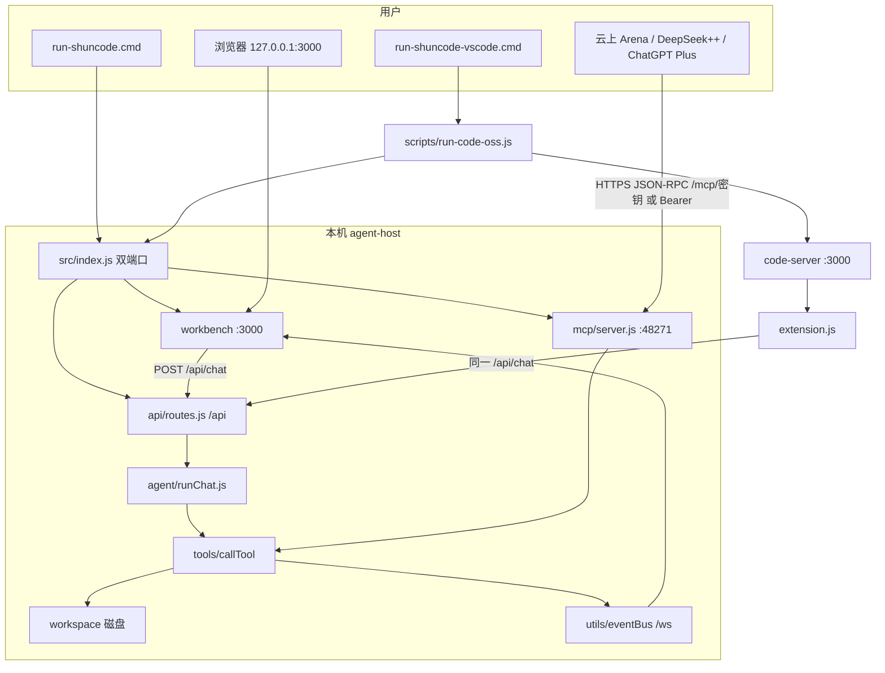

# 总览（知识图谱）

第一、二阶段在各子文件夹生成的 `README.md` 汇总。本文件只做索引与全局链路，**不替代**根目录产品首页 [README.md](./README.md)（Windows 怎么跑请仍看 [使用指南.md](./使用指南.md)）。

仓库根 **没有** `requirements.txt`、`docker-compose.yml`、根 `package.json`。依赖与启动见第 4 节。

---

## 快速导航

入口与核心函数 → 对应说明书锚点（GitHub 对 `### 📄 文件名：\`xxx.js\`` 生成的 slug 多为 `文件名xxxjs`）。

| 你要找的 | 文件 | 说明书 |
|---|---|---|
| Windows 主入口 | `run-shuncode.cmd` | [启动脚本说明 · run-shuncode.cmd](./启动脚本说明.md#文件名run-shuncodecmd) |
| 进程入口 `persistIdentity` / `listenOrExit` | `src/index.js`、`config.js` | [src · index.js](./shuncode-core/agent-host/src/README.md#文件名indexjs) · [config.js](./shuncode-core/agent-host/src/README.md#文件名configjs) |
| MCP `handleRpc` / `requireAuth` | `src/mcp/server.js` | [mcp · server.js](./shuncode-core/agent-host/src/mcp/README.md#文件名serverjs) |
| OAuth / PKCE `verifyAccessToken` | `src/mcp/oauth.js` | [mcp · oauth.js](./shuncode-core/agent-host/src/mcp/README.md#文件名oauthjs) |
| 连接提示词 `getBootstrapPrompt` | `src/mcp/instructions.js` | [mcp · instructions.js](./shuncode-core/agent-host/src/mcp/README.md#文件名instructionsjs) |
| 客户端配方 `listClients` | `src/mcp/clients.js` | [mcp · clients.js](./shuncode-core/agent-host/src/mcp/README.md#文件名clientsjs) |
| 工具总闸 `callTool` / `getToolList` | `src/tools/index.js` | [tools · index.js](./shuncode-core/agent-host/src/tools/README.md#文件名indexjs) |
| 别名 `resolveToolName` / `normalizeToolArgs` | `src/tools/normalize.js` | [tools · normalize.js](./shuncode-core/agent-host/src/tools/README.md#文件名normalizejs) |
| 读哈希缓存 `rememberHash` | `src/tools/readCache.js` | [tools · readCache.js](./shuncode-core/agent-host/src/tools/README.md#文件名readcachejs) |
| 打补丁 `applyPatch` / `resolveSafePath` | `src/tools/patchEngine.js` | [tools · patchEngine.js](./shuncode-core/agent-host/src/tools/README.md#文件名patchenginejs) |
| 跑命令 `executeCommand`（Windows=PowerShell） | `src/tools/executor.js` | [tools · executor.js](./shuncode-core/agent-host/src/tools/README.md#文件名executorjs) |
| 本机 Chat `runChat` / `runBuiltin` | `src/agent/runChat.js` | [agent · runChat.js](./shuncode-core/agent-host/src/agent/README.md#文件名runchatjs) |
| 有 Key 时工具循环 `runOpenAI` | `src/agent/openai.js` | [agent · openai.js](./shuncode-core/agent-host/src/agent/README.md#文件名openaijs) |
| 工作台 REST `POST /chat`、`/bridge/*`、`/bridge/reset-round` | `src/api/routes.js` | [api · routes.js](./shuncode-core/agent-host/src/api/README.md#文件名routesjs) |
| 隧道日志解析 `parseTunnelUrl` | `src/tunnel/cloudflared.js` | [tunnel · cloudflared.js](./shuncode-core/agent-host/src/tunnel/README.md#文件名cloudflaredjs) |
| 事件推送 `broadcast` | `src/utils/eventBus.js` | [utils · eventBus.js](./shuncode-core/agent-host/src/utils/README.md#文件名eventbusjs) |
| 工作台 UI | `workbench/app.js` | [workbench · app.js](./shuncode-core/workbench/README.md#文件名appjs) |
| VS Code `activate` / `modeFromChatRequest` | `extension/extension.js` | [extension · extension.js](./shuncode-core/extension/README.md#文件名extensionjs) |
| 网页 VS Code `main` / `ensure` | `scripts/run-code-oss.js` | [scripts · run-code-oss.js](./shuncode-core/scripts/README.md#文件名run-code-ossjs) |
| 默认演示 `divide` | `workspace/src/calculator.js` | [workspace · calculator.js](./workspace/README.md#文件名srccalculatorjs) |
| 文档必须随功能改 | `workspace/.shuncode/skills/docs-sync/SKILL.md` | [workspace · docs-sync](./workspace/README.md#文件名shuncodeskillsdocs-syncskillmd) |

类（源码里明确 `class` 的很少）：

| 类 | 说明书 |
|---|---|
| `ProtocolError` / `ExecutionError` | [mcp · errors.js](./shuncode-core/agent-host/src/mcp/README.md#文件名errorsjs) |
| `ChatView` / `BridgeView` | [extension · extension.js](./shuncode-core/extension/README.md#文件名extensionjs) |
| 原型 `TunnelManager` / `BridgeEventBus`（冻结） | [shuncode-repro](./shuncode-repro/README.md#文件名srctunneltunnelmanagerjs) |

---

## 1. 子模块索引

「详细文档」一律指向该文件夹内部 README（相对本文件）。

| 子模块 | 路径 | 定位 | 详细文档 |
|---|---|---|---|
| 产品代码根 | `shuncode-core/` | 现行程序；本层只有 `start-shuncode.sh` | [查看详情](./shuncode-core/README.md) |
| agent-host 包 | `shuncode-core/agent-host/` | npm 包根：`package.json` 的 start/test | [查看详情](./shuncode-core/agent-host/README.md) |
| 进程入口 | `…/src/` | `config.js` + `index.js` 双端口 | [查看详情](./shuncode-core/agent-host/src/README.md) |
| MCP | `…/src/mcp/` | Streamable HTTP、OAuth、instructions、clients | [查看详情](./shuncode-core/agent-host/src/mcp/README.md) |
| 工具 | `…/src/tools/` | 约 25 正式名；`normalize.js` 收 `bash`/`cat`/`ls` 等别名；`readCache.js` 记 sha256 | [查看详情](./shuncode-core/agent-host/src/tools/README.md) |
| 本机 Chat | `…/src/agent/` | `runChat`；网页 Agent **不进**这里 | [查看详情](./shuncode-core/agent-host/src/agent/README.md) |
| 模型/工作区配置 | `…/src/models/` | `.shuncode` store / profile / memory | [查看详情](./shuncode-core/agent-host/src/models/README.md) |
| REST | `…/src/api/` | `/api/chat`、`/api/bridge/*`、文件树 | [查看详情](./shuncode-core/agent-host/src/api/README.md) |
| 隧道 | `…/src/tunnel/` | 解析 cloudflared 日志 | [查看详情](./shuncode-core/agent-host/src/tunnel/README.md) |
| 工具函数 | `…/src/utils/` | eventBus、diff | [查看详情](./shuncode-core/agent-host/src/utils/README.md) |
| 产品测试 | `…/tests/` | Node assert，无 Jest | [查看详情](./shuncode-core/agent-host/tests/README.md) |
| 工作台 UI | `shuncode-core/workbench/` | 浏览器 3000 | [查看详情](./shuncode-core/workbench/README.md) |
| VS Code 插件 | `shuncode-core/extension/` | `@shuncode` 默认 Agent=code | [查看详情](./shuncode-core/extension/README.md) |
| 插件安装副本 | `shuncode-core/extensions-installed/` | 不要在这里改 JS | [查看详情](./shuncode-core/extensions-installed/README.md) |
| 网页 VS Code 脚本 | `shuncode-core/scripts/` | npm 拉 code-server 4.135.0 | [查看详情](./shuncode-core/scripts/README.md) |
| 默认工作区 | `workspace/` | 演示计算器 + `.shuncode`（含 `docs-sync` Skill） | [查看详情](./workspace/README.md) |
| 运行时目录 | `bin/` | `code-server-runtime` 不进 Git | [查看详情](./bin/README.md) |
| 冻结原型 | `shuncode-repro/` | **不要运行**；单端口 3000、8 工具 | [查看详情](./shuncode-repro/README.md) |
| 根启动脚本 | 仓库根 `.cmd` / `.sh` / `.gitignore` / `.gitattributes` | 不是子文件夹 README | [启动脚本说明.md](./启动脚本说明.md) |
| code-server 配置 | `.config/code-server/` | 网页 VS Code 的 `--config` yaml | [查看详情](./.config/code-server/README.md) |

依赖方向（产品路径，不含 repro）：

```text
run-shuncode.cmd
    → agent-host/src/index.js
        → workbench/（静态）
        → mcp/oauth.js + mcp/server.js
        → api/routes.js
        → tunnel/（POST /bridge/start 且 provider=cloudflare 时 spawn）
        → tools/* ← agent/runChat.js
                 ← mcp/server.js tools/call
        → models/*、utils/eventBus
```

---

## 2. 数据流向图（用户请求 → 响应）

三条路径 **改盘引擎都是** `tools/index.js` 的 `callTool`。差别只是谁下指令。

### 2.1 总图



### 2.2 路径 A：本机 Chat（不需要隧道）

```text
用户在工作台 CHAT 回车
  → workbench/app.js fetch POST /api/chat
  → api/routes.js L178–L200 NDJSON
  → agent/runChat.js
       有 apiKey+baseUrl+modelId → openai.runOpenAI（最多 10 轮 tool_calls）
       否则 → runBuiltin：explore 只读 → Ask 摘要 / Plan consensusEngine / Code 补丁或围栏再 npm test
  → tools/callTool(name, args, mode)   ← 本机传 ask|plan|code，模式锁生效
  → patchEngine / fileOps / executor（Windows PowerShell）
  → 工作区文件变化
  → eventBus.broadcast → /ws → 右侧工具卡
```

VS Code 侧栏 / `@shuncode`：`extension.js` 的 `postNdjson` 打 **同一条** `/api/chat`，后面不变。

### 2.3 路径 B：网页 Agent → MCP → 本机仓库

```text
云上聊天栏
  → HTTPS https://*.trycloudflare.com/mcp/<secret>
       或 ChatGPT Plus：canonical /mcp + Bearer（oauth.js PKCE）
  → Cloudflare 转到本机 :48271
  → mcp/server.js requireAuth
       extractToken：Bearer → 路径密钥 → x-mcp-secret → query
  → handleRpc
       initialize → instructions.getInstructions()
       tools/list → getToolList()（不按 mode 过滤）
        tools/call → callTool(name, args, remoteToolMode)   ← 默认 code；_meta.mode 可切 ask/plan
  → 与路径 A 同一套 tools/*
  → 工作台 BRIDGE 经 WebSocket 看到卡片
```

身份对照：

| 客户端 | 凭证 | 说明书 |
|---|---|---|
| Arena 等 paste-url | URL 含 secret + CONNECT_LINE | [clients.js](./shuncode-core/agent-host/src/mcp/README.md#文件名clientsjs) |
| DeepSeek++ | Streamable HTTP，prompt **只有 URL** | 同上；扩展不进本仓库 |
| ChatGPT 免费聊天 | 通常调不了 MCP | `chatgpt-free` = unsupported-mcp |
| ChatGPT Plus 连接器 | OAuth `scat_` + `/mcp` 无长期密钥 | [oauth.js](./shuncode-core/agent-host/src/mcp/README.md#文件名oauthjs) |

**源码事实：** `POST /api/bridge/start`（[routes.js](./shuncode-core/agent-host/src/api/README.md#文件名routesjs)）在登录校验后置 `bridgeRunning`、写 pairing；**`tunnelProvider==='cloudflare'` 时 `await tunnel.startQuickTunnel({ port })`**。成功则 `mcpOrigin` 用 `https://*.trycloudflare.com`；无 cloudflared / 超时仍 200，MCP 走当前 Host。`POST /bridge/stop` 调 `stopTunnel`。Named / ngrok **不** spawn。隧道模块见 [tunnel/README.md](./shuncode-core/agent-host/src/tunnel/README.md)。

### 2.4 路径 C：网页 VS Code

```text
run-shuncode-vscode.cmd
  → scripts/run-code-oss.js
       ensure() 可能 npm 安装 code-server@4.135.0 → bin/code-server-runtime/
       syncExtension() 拷 extension/ → extensions-installed/
       spawn agent-host SHUNCODE_SKIP_WORKBENCH=1（不占 3000）
       wait /health :48271
       spawn code-server :3000
  → 插件 activate → 仍 POST http://127.0.0.1:48271/api/chat
```

不要与 `run-shuncode.cmd` 同时开（抢 3000）。

### 2.5 一次 apply_patch 在文件夹之间怎么走

```text
MCP tools/call 或 Chat timedTool
  → tools/index.js callTool
       resolveToolName（bash→run_command 等）
       normalizeToolArgs（path→filePath，"true"→布尔）
  → patchEngine.applyPatch
       resolveSafePath → sensitive.assertNotSensitive
       没传 expectedHash → recalledHash（上次 read_files / 成功补丁）
       仍无 hash（文件从未被本进程读过）→ HASH_REQUIRED + detail.currentHash
       expectedHash 不符 → STALE_FILE + detail.currentHash
       SEARCH/REPLACE 或 unified diff
       写 .tmp.* 再 renameSync
       rememberHash
  → eventBus.broadcast('file_patched')
  → utils/diff.createUnifiedDiff 给 UI
  → 磁盘 = config.workspaceRoot（默认仓库 workspace/）
```

---

## 3. 环境与配置总览

### 3.1 仓库里实际有的清单

| 常见文件 | 本仓库 |
|---|---|
| 根 `package.json` | **无** |
| `requirements.txt` | **无**（无 Python 服务） |
| `docker-compose.yml` | **无** |
| `shuncode-core/agent-host/package.json` | **有**：运行时 `express` `ws` `cors` `diff`；`scripts.start` / `scripts.test` |
| `workspace/package.json` | 演示计算器，`npm test` → `tests/calculator.test.js` |
| `shuncode-repro/package.json` | 冻结原型，**不要 npm start** |
| `bin/code-server-runtime/package.json` | 占位，依赖恰好 `code-server@4.135.0` |

agent-host 依赖 Key 见 [agent-host/README.md](./shuncode-core/agent-host/README.md#文件名packagejson)。

### 3.2 Install → Build → Run

**没有单独 Build 步。** 自绘工作台是静态 `workbench/*.html|js|css`，由 Express 直接托管。

**Install**

1. 安装 [Node.js LTS](https://nodejs.org/)（勾选 npm）。Windows 用 **CMD**。
2. 仓库根：

```bat
check-env.cmd
```

检查 PATH 里的 node / npm / git / cloudflared。git、cloudflared 不是启动的硬前置（缺 git 则 git 工具不可用；缺 cloudflared 则本机 Chat 仍可跑）。

3. 依赖：第一次 `run-shuncode.cmd` 若没有 `shuncode-core\agent-host\node_modules\express` 会执行 `npm install --no-audit --no-fund`。不必在仓库根 `npm install`。

**Build**

无。不要找 `npm run build`。网页 VS Code 第一次会从 npm **下载** code-server（约 50MB+），那是安装运行时，不是编译本仓库。

**Run**

```bat
run-shuncode.cmd
```

默认工作区 `.\workspace`。改自己的仓库（路径必须已存在）：

```bat
run-shuncode.cmd D:\code\my-app
```

浏览器：**http://127.0.0.1:3000**（工作台）。MCP：**http://127.0.0.1:48271**（见黑窗口打印的 `/mcp/<密钥>`）。

停：CMD 窗口 **Ctrl+C**。

其它：

| 目的 | 命令 |
|---|---|
| 网页真 VS Code | `run-shuncode-vscode.cmd`（工作区必须已存在） |
| 跑产品测试 | `run-tests.cmd` → `agent-host` 的 `npm test` |
| Linux/macOS 对照 | `./run-shuncode.sh`（指南主体仍是 CMD） |

环境变量（`src/config.js` 与根 `.cmd` 一致）：

| 变量 | 默认 | 含义 |
|---|---|---|
| `WORKSPACE_ROOT` | 仓库 `workspace/` | 工具允许读写的根 |
| `WORKBENCH_PORT` | `3000` | 工作台 UI |
| `AGENT_HOST_PORT` | `48271` | MCP / `/api` |
| `SHUNCODE_SKIP_WORKBENCH` | 未设 | `1` 时不听 3000（vscode 入口会设） |

### 3.3 不要当成启动方式的东西

- `cd shuncode-repro && npm start` — 冻结原型，端口/工具/密钥都对不上。
- 根目录再造 `tests/` — 测试已在 `shuncode-core/agent-host/tests/`。
- `bin/code-server-dist` — 已删除；测试禁止再 vendor。
- 为连 Bridge 去装 `deepseek-pp-shell-host` — 不需要。

---

## 4. 和其它根文档的分工

| 文档 | 角色 |
|---|---|
| [README.md](./README.md) | GitHub 首页：最短开始 |
| [组件说明.md](./组件说明.md) | 小白工作流、为什么这样装 |
| [技术实现.md](./技术实现.md) | 代码逐步直译 |
| [使用指南.md](./使用指南.md) | Windows 按键 |
| **本文件 总览.md** | 子 README 索引 + 全局调用链 + 环境 |

第四阶段未提供正文，不在此自拟。
